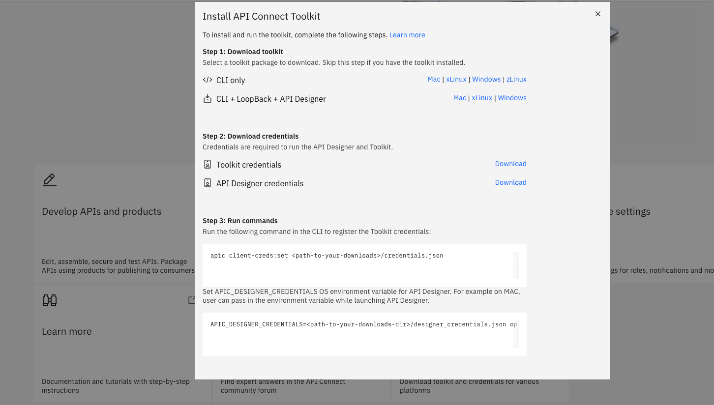
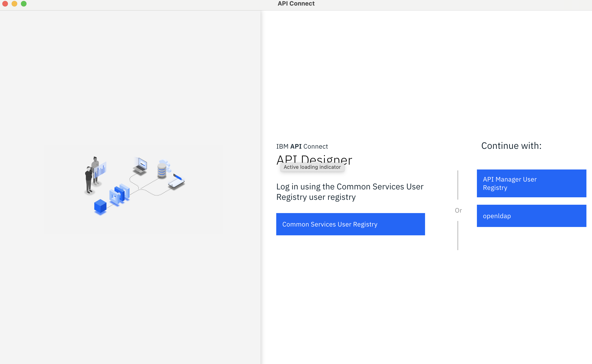
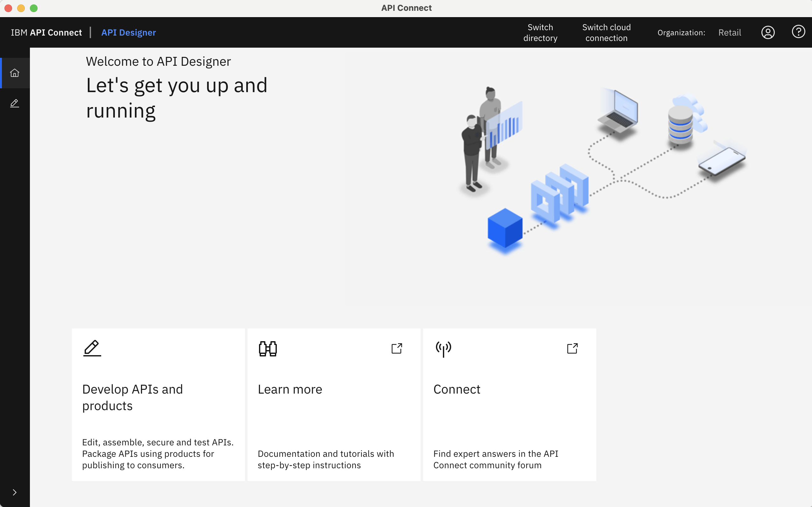

## Configure API Connect Developer toolkit

In this exercise you will configure API Connect Developer toolkit locally. 

### Step 1

Download the developer toolkit and credetial files for your Operating System (OS) either from Cloud Manager or API Manager.

Click on 'Download toolkit'.

### Step 2

Extract the 'APIC Designer' and 'apic' CLI files in a directory. You can choose to keep 'credentials.json' and 'designer_credentials.json' files in the same different directory.

### Step 3

Create a workspace directory on you machine.

### Step 4

Run below commands to set the credentials for the toolkit.

`apic client-creds:set <path-to-your-downloads>/credentials.json`

Use the below command to determine the identity provider. 'mgmt_endpoint_url' for you environment will be provided by the instructor.

`apic identity-providers:list --scope provider --server <mgmt_endpoint_url> --fields title,realm`

Set APIC_DESIGNER_CREDENTIALS OS environment variable for API Designer. For example on MAC, user can pass in the environment variable while launching API Designer.

`APIC_DESIGNER_CREDENTIALS=<path-to-your-downloads-dir>/designer_credentials.json open <path-to-downloaded-api-designer-app>/'API Designer.app'`

It will launch the APIC Designer toolkit and ask you to select the workspace. Choose the directory you created in step 3 and proceed.

Not select the login method and supply credentials. It will connect the toolkit to your target Provider organization.

Congratulations! You have configured APIC Developer toolkit locally and can proceed with developing APIs.

