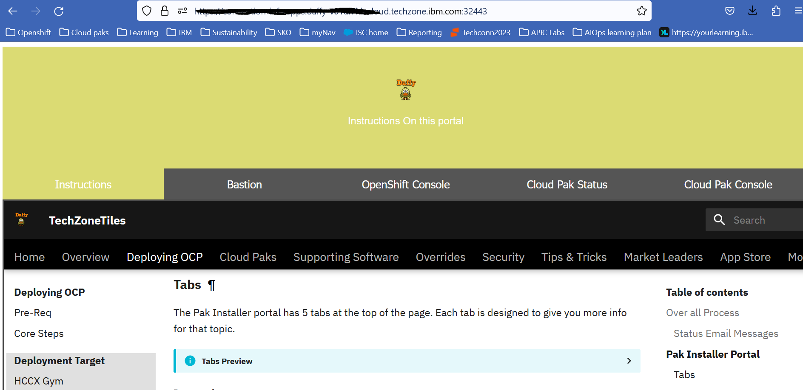
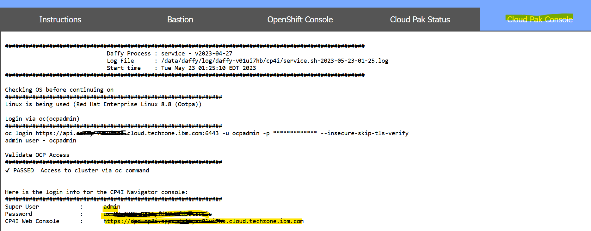
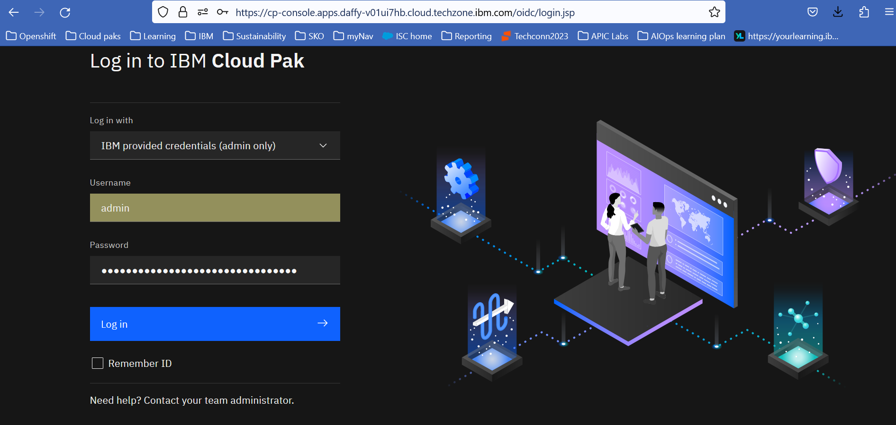
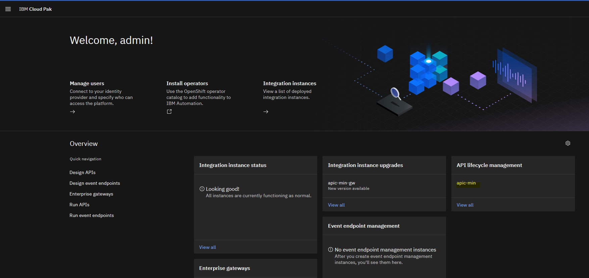
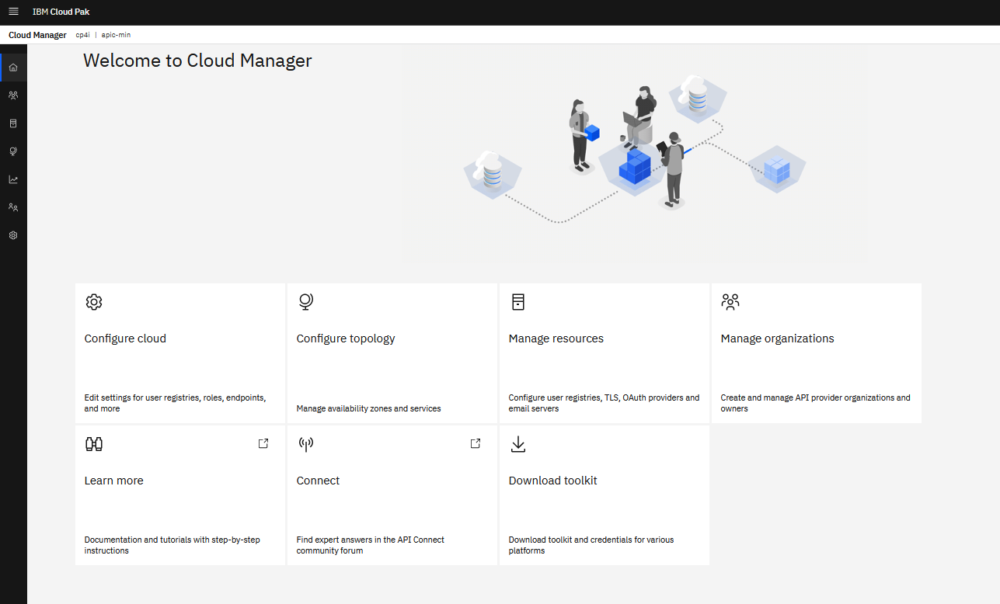
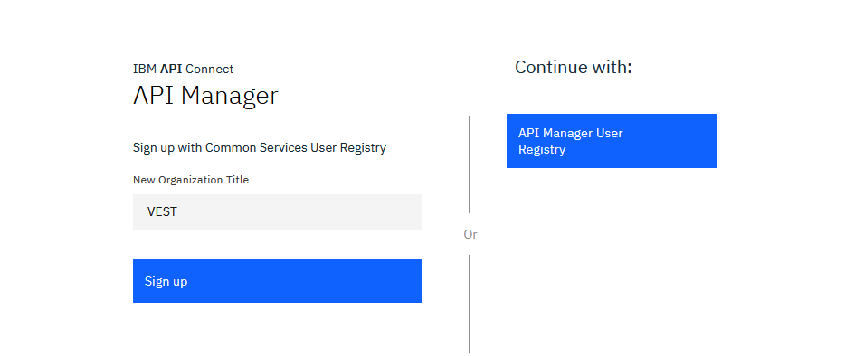

**APIC VEST Lab 0 - Get Started**

In this lab, you will get started with Lab environment and create  
a Provider Organization.

In this tutorial, you will explore the following capabilities:

-   Access the Lab environment.

-   Access the Cloud Pak Console. 

- 	Access the API Connect Cloud Manager Console.

-   Configure an Email server for notifications.

-   Create a Provider Organization.

 APIC VEST Series
====================================================================================================================================================================

The APIC VEST Series is a hands-on workshop with lab exercises that
walk you through designing, publishing, and securing APIs. This workshop
is for API developers, architects, and line of business people who want
to create a successful API strategy. There are 9 labs and each is 30
minutes long. Make sure you choose enough time in your reservation to
get through all the labs! 

[NOTE: ]**[This demo environment contains a
full API Connect installation in Cloud Pak for Integration. The login
information to the APIC cluster will be sent in a separate email when
you reserve the instance. Use Google Chrome, Firefox or Microsoft Edge
to access the cluster using the credentials supplied. Make sure you
login using Common Services registry.]**

[Lab 1 : Create and Secure an API to Proxy an Existing REST Web
service](https://github.com/ibm-ecosystem-lab/APICv10/tree/main/instructions/Lab1)

[Lab 2 : The Developer Portal
Experience](https://github.com/ibm-ecosystem-lab/APICv10/tree/main/instructions/Lab2)

[Lab 3 : Add OAuth Security to your
API](https://github.com/ibm-ecosystem-lab/APICv10/tree/main/instructions/Lab3)

[Lab 4 : Use Lifecycle Controls to Version Your
API](https://github.com/ibm-ecosystem-lab/APICv10/tree/main/instructions/Lab4)

[Lab 5: Advanced API
Assembly](https://github.com/ibm-ecosystem-lab/APICv10/tree/main/instructions/Lab5)

[Lab 6: Working with API
Products](https://github.com/ibm-ecosystem-lab/APICv10/tree/main/instructions/Lab6)

[Lab 7: The Consumer
Experience](https://github.com/ibm-ecosystem-lab/APICv10/tree/main/instructions/Lab7)

[Lab 8: Create and test GraphQL Proxy
API](https://github.com/ibm-ecosystem-lab/APICv10/tree/main/instructions/Lab8)

[Lab 9: Creating GraphQL API with StepZen](https://github.com/ibm-ecosystem-lab/APICv10/tree/main/instructions/Lab9)

 Login to API Connect Cloud Manager
===========================================================================================

1. Open a browser window and go to the Pak Installer Portal. 
   Login using the user id and password provided by the instructors.
   
    
	
2. Click on the Cloud Pak Console tab and go to the CP4I Web Console url
   and Login to the Cloud pak console with the super user (admin) and password
   provided.

    
	
	
	
3. 	From the Home screen of the cloud pak console, click on the **apic-min**
	under API lifecycle management.
	
	
	
4. You will be redirected to the API manager login screen as shown below.

	
	
5. We will first create a provider organization from the Cloud Manager console.
   Hence, change the url to Cloud Manager console by replacing **manager** to **admin** in the url as below.
   
   From: https://cpd-cp4i.apps.daffy-v01ui7hb.cloud.techzone.ibm.com/integration/apis/cp4i/apic-min/auth/manager/sign-in/
   
   To: https://cpd-cp4i.apps.daffy-v01ui7hb.cloud.techzone.ibm.com/integration/apis/cp4i/apic-min/auth/admin/sign-in/
   
6. Log in to the Cloud Manager console using the **Common Services User Registry** user registry.

	
	
7. You will be able to see cloud manager console home screen as shown below.

	
	
 Configure an Email Server
===========================================================================================
	
1. Click Resources icon in the left navigation menu or Manage Resources tile.

2. Cick Notifications and then Click Create button.

	
	
3. For the Title, enter [[apic email server]]
	Address, enter [[smtp-relay.sendinblue.com]]
	Port, enter [[587]]
	Authenticate user, enter [[]]
	Authenticate password, enter [[]]
	as shown below.
	
		
	
4. Scroll down and click **Test email**.
   Enter your email address and click send email. 	
	
		
	
	Make sure that the email is sent successfully and click **Save**.

 Create a Provider Organization
===========================================================================================

1. Click on Provider Organization icon in the left navigation menu OR 
   Click on Manage Organizations tile from the Cloud Manager console Home.
   
2. Click [[Add-\>Invite organization owner]] to Invite owner of the provider organization.
   
   

3. Specify your email address as the Owner's email address and Click **Invite**.

   
   
4. Notice appears when the activation email is sent. 
   
5. Copy the Activation link (from notice or as recieved in the email) and paste it in new browser window. 

   
   
6. Enter [[VEST]] as the New Organization Title and Click **Sign up**.

7. Provider Organization should be created successfully as shown below.

   
   
   Provider organization in Cloud Manager console as shown below.

         

 Summary
=============================================================

You completed the APIC VEST Lab 0 - Get Started. 
Throughout the tutorial, you explored the key takeaways:

-   Access the Lab environment.

-   Access the Cloud Pak Console. 

- 	Access the API Connect Cloud Manager Console.

-   Configure an Email server for notifications.

-   Create a Provider Organization.

Continue the APIC VEST! Go to [APIC VEST Lab 1 - Create and Secure an API](https://github.com/ibm-ecosystem-lab/APICv10/tree/main/instructions/Lab1) to
learn how to create and secure a new API using API Connect.
