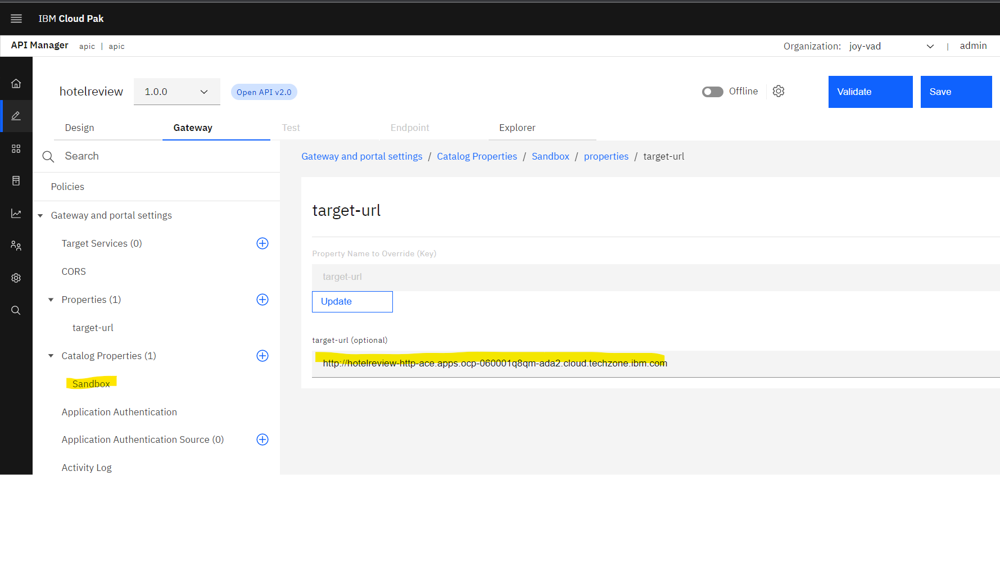
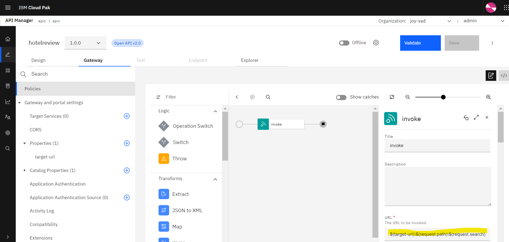
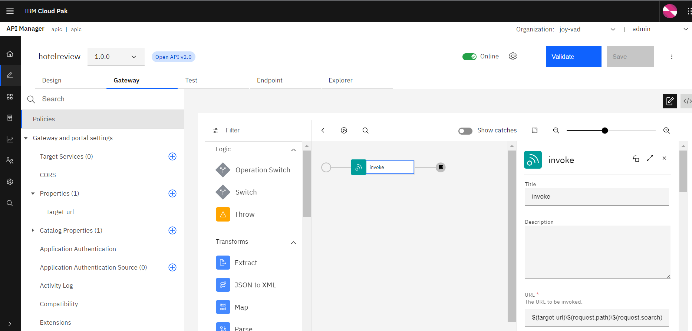
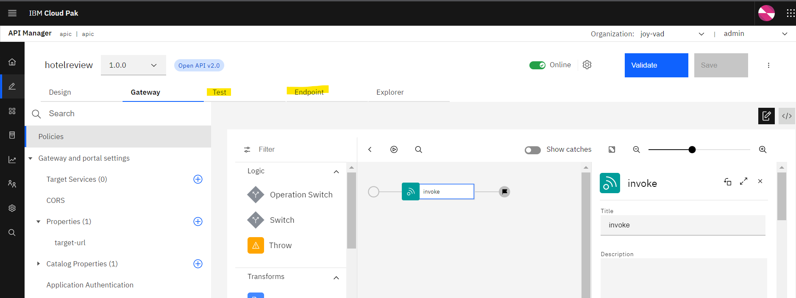
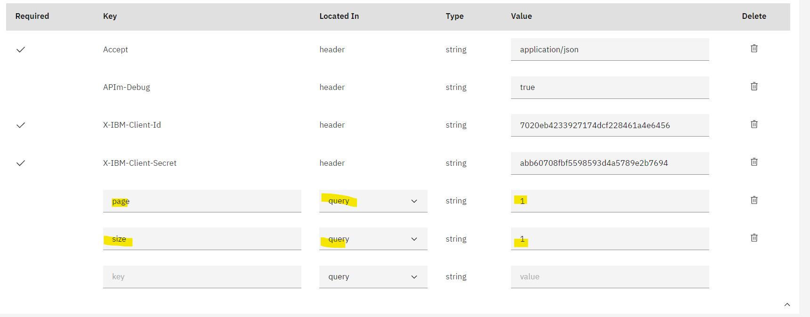
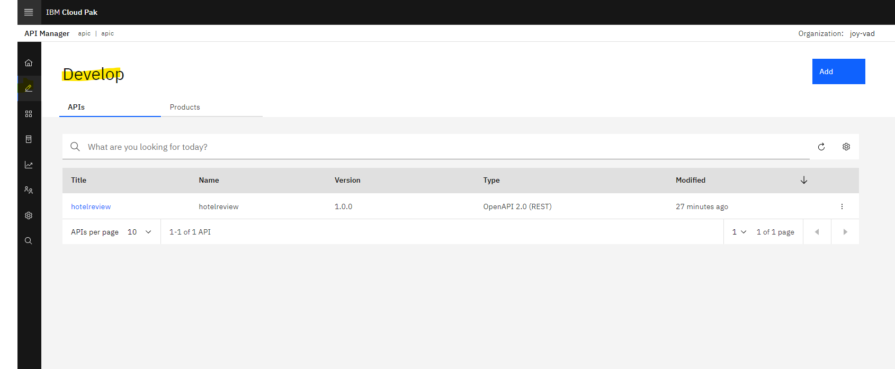
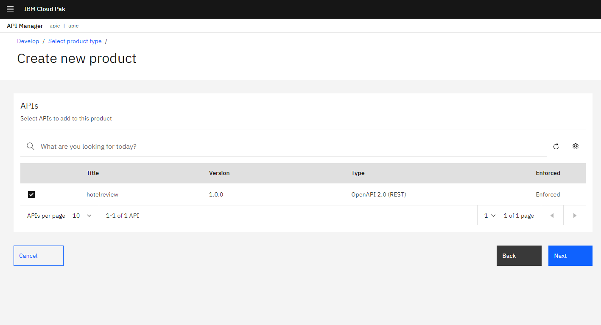
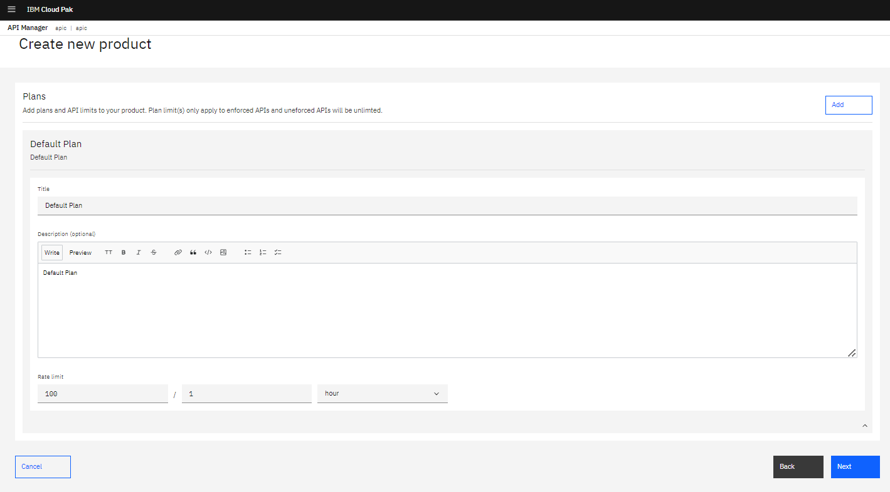
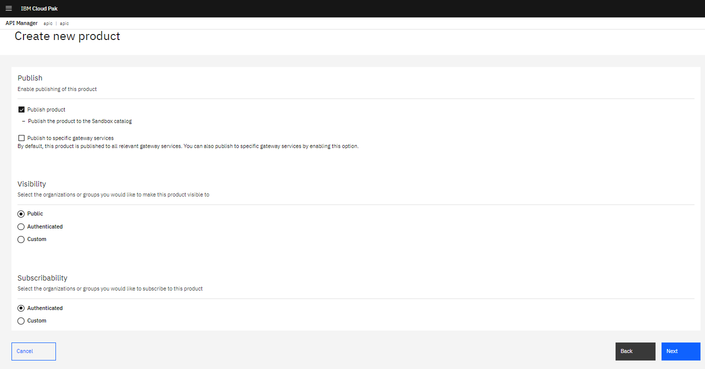

**APIC VEST Lab 1 - Create and Secure an API**

In this lab, you will get a chance to use the online APIC Developer
Toolkit and its intuitive interface to create a new API using the
OpenAPI definition (YAML) of the existing product HotelReview RESTful
web-service.

In this tutorial, you will explore the following key capabilities:

-   Creating an API by importing an OpenAPI definition for an existing
    REST service.

-   Configuring ClientID/Secret Security, endpoints, and proxy to invoke
    endpoint.

-   Testing a REST API in the online developer toolkit.

-   Publish an API for developers.

 APIC VEST Series
====================================================================================================================================================================

The APIC VEST Series is a hands-on workshop with lab exercises that
walk you through designing, publishing, and securing APIs. This workshop
is for API developers, architects, and line of business people who want
to create a successful API strategy. There are 9 labs and each is 30
minutes long. Make sure you choose enough time in your reservation to
get through all the labs! 

[NOTE: ]**[This demo environment contains a
full API Connect installation in Cloud Pak for Integration. The login
information to the APIC cluster will be sent in a separate email when
you reserve the instance. Use Google Chrome, Firefox or Microsoft Edge
to access the cluster using the credentials supplied. Make sure you
login using Common Services registry.]**

[Lab 1 : Create and Secure an API to Proxy an Existing REST Web
service](https://github.com/ibm-ecosystem-lab/APICv10/tree/main/instructions/Lab1)

[Lab 2 : The Developer Portal
Experience](https://github.com/ibm-ecosystem-lab/APICv10/tree/main/instructions/Lab2)

[Lab 3 : Add OAuth Security to your
API](https://github.com/ibm-ecosystem-lab/APICv10/tree/main/instructions/Lab3)

[Lab 4 : Use Lifecycle Controls to Version Your
API](https://github.com/ibm-ecosystem-lab/APICv10/tree/main/instructions/Lab4)

[Lab 5: Advanced API
Assembly](https://github.com/ibm-ecosystem-lab/APICv10/tree/main/instructions/Lab5)

[Lab 6: Working with API
Products](https://github.com/ibm-ecosystem-lab/APICv10/tree/main/instructions/Lab6)

[Lab 7: The Consumer
Experience](https://github.com/ibm-ecosystem-lab/APICv10/tree/main/instructions/Lab7)

[Lab 8: Create and test GraphQL Proxy
API](https://github.com/ibm-ecosystem-lab/APICv10/tree/main/instructions/Lab8)

[Lab 9: Creating GraphQL API with StepZen](https://github.com/ibm-ecosystem-lab/APICv10/tree/main/instructions/Lab9)

 Import API to the Developer Workspace
===========================================================================================

First, we will download the OpenApi file for the existing REST service
for HotelReview. Then, we will import it to the online workspace.

1.  Open a browser window to the API Manager Portal. If the screen
    displays [[\"Your connection is not
    private\"]] click
    Advanced, and then Accept the to continue. Log in with the username
    ad credentials supplied.

    

    

2.  Click on the [[Develop APIs and
    Products]] tile
    to enter the online development workspace.

      

3.  Now you are in the home screen of the online developer tool. From
    here, you can begin to create APIs and Products.

      

4.  Click [[ADD-\>API.]]

      

5.  On the next screen, select [[Existing OpenAPI]] under
    Import**,** as in the image below. Then
    click **[Next.]**

      

6.  Now download the[[HotelReview.yaml]] 
    file the dte-labs git repository using the following command.

    ```
    curl -OL https://raw.githubusercontent.com/ibm-ecosystem-lab/APICv10/main/hotelreview.yaml

    ```

    You can also down the file using this link : [hotelreview.yaml](https://github.com/ibm-ecosystem-lab/APICv10/blob/main/hotelreview.yaml)

    Choose the downloaded
    [[HotelReview.yaml]] OpenAPI
    definition and Click **[Next.]**

      

7.  **[Do not ]**select **[Activate
    API]**.
    Click [[Next]].

      

8.  The API should be imported successfully as shown in the image below.
    Click [[Edit
    API]].

    

 Configure API
===================================================================

After importing the existing API, the first step is to configure basic
security before exposing it to other developers. By creating a client
key and secret security, you are able to identify the app using the
services. Next, we will define the backend endpoints where the API is
actually running. API Connect supports pointing to multiple backend
endpoints to match your multiple build stage environments. Finally, we
will configure the proxy call to invoke the endpoint.

 Configure API Key security
---------------------------------------------------------------------------------------------------------------------------------------------

1.  Click [[Security Schemes]].

2.  In the [[Security Schemes]] section,
    click
    the [[Add]] button
    on the right. This will open a new view titled [**[Add Object]**[.]]

3.  In the **[Name]** field,
    type [[client-id]].

4.  Under **[Type]**, choose [[API
    Key]].
    This will reveal additional settings.

5.  For **[Located
    In]** choose [[Header]].
    For **[Key Type]** choose [[Client
    ID]].
    In [[Variable
    Name]] type [[X-IBM-Client-Id]].
    Your screen should look like the image below. 

    

6.  Click
    the [[Create]] button
    to return to the **[Security Schemes]** section.

7.  Click [[Add]] again
    to add the client secret definition.

8.  Under **[Name,]** type [[secret]].

9.  For **[Located
    In]** choose [[Header]].
    For **[Key Type]** choose [[Client
    Secret]].
    In [[Variable
    Name]] type [[X-IBM-Client-Secret]].
    Your screen should look like the image below. 

    

10. Click
    the [[Create]] button
    to return to the **[Security Schemes]** section.

11. Click [[Security]] in
    the left menu.

12. Click [[Add. ]]This will
    populate the **[Security Schemes]** table with secret and
    client-id. Select both as shown in the image below. Then
    click [[Create]]. 

    

13. Add security and enable secret and client-id. Click **Save** to save
    the changes.

    

 Define Target-URL for Sandbox environment
------------------------------------------------------------------------------------------------------------------------------------------------------------

1.  Click on [[Gateway]] tab in the top menu and expand [[Gateway and portal settings]].

2.  Click on the target-url property under [[Properties]] section. The target-url property is
    automatically inserted to be able to define multiple run-time
    targets for the service.

3.  In the **[Property value]** text field,
    type [http://hotelreview-http-ace.apps.ocp-060001q8qm-ada2.cloud.techzone.ibm.com/)**[.]**

4.  Click Add in the [[Catalog Properties]] and select Choose the [Sandbox] for the name and click Create.

5.  Choose [[Sandbox]] and
    for the target-url
    type [http://hotelreview-http-ace.apps.ocp-060001q8qm-ada2.cloud.techzone.ibm.com/)



6.  Click **[Save]** to complete the
    configuration.

 Configure Proxy Call in Designer
---------------------------------------------------------------------------------------------------------------------------------------------------

1.  Click on [[Gateway]] tab in the top menu and Click [[Policies]] in the left navigation.

2.  Click [[Invoke]] in
    the flow
    designer.  

3.  This will open a window from the right to configure. In the URL
    field, type **[$(target-url)$(request.path)$(request.search)]**. 

4.  Click [[Save]].



 Test the API
==================================================================

In the API designer, you have the ability to test the API immediately
after creation in the Policies view! 

1.  Toggle
    [[Offline]]
    to activate API. to publish the API itself to the gateway for
    testing.  

    

2.  After the API is published, additional tabs appear your screen
    should look like the image below.
    

3.  Choose **[Test]** tab and Select GET request **[/reviews]** as shown below.

    

4.  Your client Id  and client secret for the sandbox-test-app is
    prefilled.

5.	Add two query parameter to the API request like in the image below.
    

6.  Scroll all the way to the top of the test view.    

7.  Click [[Send]].

8.  If this is the first test of the API, you will see a certificate
    exception. Simply click on the URL and choose the option to proceed.

9.  Go back to the test view and
    click [[Send]] again.

10. Now you will see a Response section with Status code 200 OK and the
    Body displaying all the hotel reviews.

    

 Publish API
=================================================================

In this lab, we will make the API available to developers. In order to
do so, the API must be first put into a product and then published to
the sandbox catalog. A product dictates rate limits and API throttling.
When the product is published, the Invoke policy defined in the previous
lab is written to the gateway. 

 Create HotelReview Product and Add API
-------------------------------------------------------------------------------------------------------------------------------------------------------

1.  From the vertical navigation menu on the left,
    click **[Develop]** to return to the
    Develop home screen.

    

2.  Click **[Add]** and
    select [Product]**.**

3.  On the next screen, select **[New
    Product]**. Then
    click **[Next]**.

4.  For the Title, enter [**[HotelReview APIs]**[.]] Click **[Next]**.

5.  Select the **[HotelReview 1.0.0 API]** as
    shown in the image below. Then
    click **[Next]**.  

    

6.  Keep the **[Default Plan]** as is.
    Click **[Next]**.  

    

7.  Under **[Publish]**, enable **[Publish
    Product]** as shown in the image below.
    Then
    click [**[Next]**[.  ]]

    

8.  The Product is now published successfully with the API base URL
    listed and available for developers from the developer portal. Go
    to [APIC VEST - Lab 2 - The Developer Portal
    Experience](https://github.com/ibm-ecosystem-lab/APICv10/tree/main/instructions/Lab2) to
    see how to access this API as a developer.

 Summary
=============================================================

You completed the APIC Dev Jam Lab 1 - Create and Secure an
API. Throughout the tutorial, you explored the key takeaways:

-   Create an API by importing an OpenAPI definition for an existing
    REST service.

-   Configure ClientID/Secret Security, endpoints, and proxy to invoke
    endpoint.

-   Test a REST API in the online developer toolkit.

-   Publish an API for developers.

Continue the APIC VEST Series! Go to [APIC VEST Lab 2 - The Developer
Portal
Experience](https://github.com/ibm-ecosystem-lab/APICv10/tree/main/instructions/Lab2) to
learn how to socialize this API and make it available to developers.
